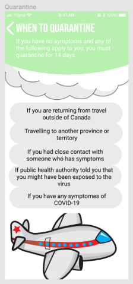

# HCI-Assignment-2
My idea for a COVID-19 application.

https://www.figma.com/file/sDxUp0osBGsqdA8oPLyjWf/Assignment-1?node-id=0%3A1

This image above shows the look of the start screen for my application, very clean and simple.

This is my main screen where the user will always go back to for navigation.

This page will show you common symptoms of COVID-19.

This page displays the current statistics of infected cases within Canada.

This page displays preventative steps.

This page displays proper steps for quarantining.

This page will show you near by places to get tested in your area.

This page will help users who tested positive.

This page will eventually display the vaccine for COVID-19.

The final page displays the updated news about COVID 19 globally.

New Desirable Functionalities

1. Minimal and simple design for elderly

2. Images and labels for easy navigation

3. Notifications for new symptoms, COVID related news, and when a treatment is available

4. Consistant colour theme throughout application

5. Location services for near by testing facilities
